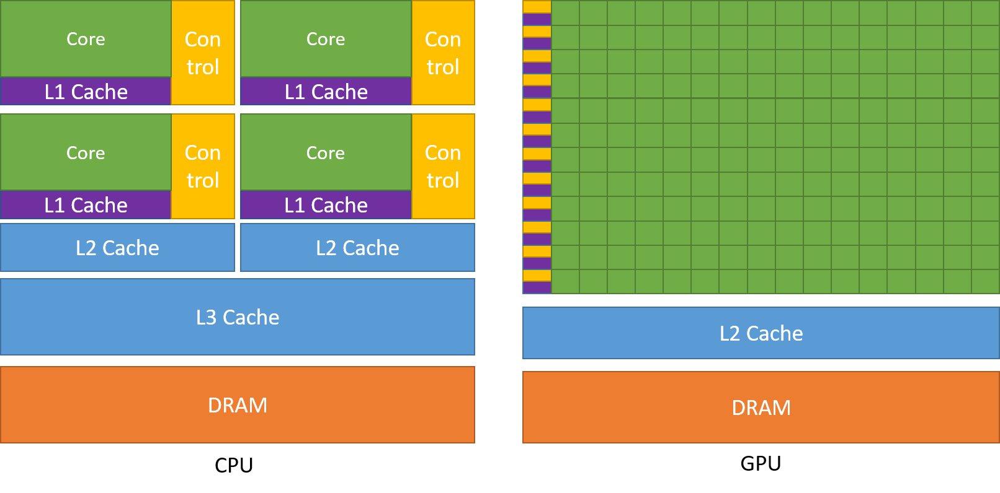
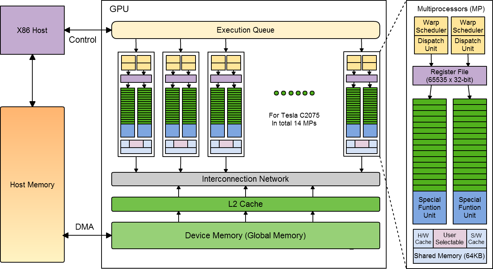
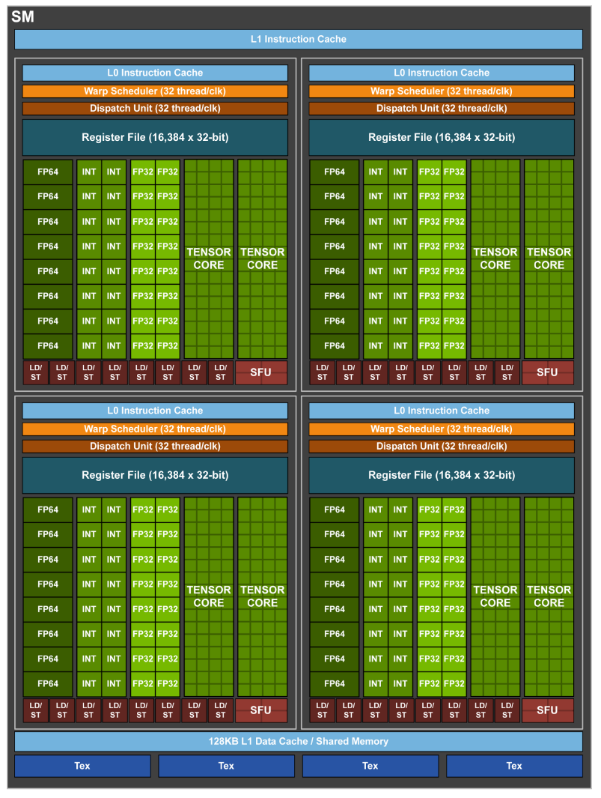

# GPU 架构

和CPU不同，GPU用于高度并行处理数据。它由大量简单的核心组成，能够同时处理多个线程。

## GPU的工作流程：

X86 Host：运行CPU程序，控制计算流程，包括启动GPU任务和管理数据传输。

GPU Device：执行并行计算任务，包含多个计算单元（CU）和流处理器（SM）。

二者通过PCLe总线连接，并通过DMA直接访问彼此内存，无需CPU干预。

GPU工作流程：
1. 主机（CPU）将计算任务（内核函数）提交至 GPU 的硬件执行队列，并通过 PCIe 总线利用 DMA 将输入数据从主机内存传输到 GPU 的全局内存（Global Memory）。

2. GPU 的调度单元将任务划分为 Warp（32 线程一组），并分发给各个 Streaming Multiprocessor（SM）。每个 SM 的 Warp 调度器动态调度 Warp 执行，以隐藏内存延迟。

3. 当线程访问数据时，全局内存的请求经由 L2 Cache 和 L1 Cache（或 Texture Cache）加载到寄存器。若程序需要线程间协作，程序员可显式将数据从全局内存加载到 Shared Memory（片上高速存储），供同一 Block 内线程共享。

4. 计算结果最终写回全局内存，主机再通过 DMA 将结果传回主机内存。 

## SM 结构

  - 64 single precision cores（FP32）
  - 32 double precision cores（FP64）
  - 64 INT32 cores
  - 8 Tensor cores
  - 128KB memory_block for L1 cache and Shared memory  
    （0–96KB for Shared memory, 96–128KB for L1 cache）
  - 65536 registers
