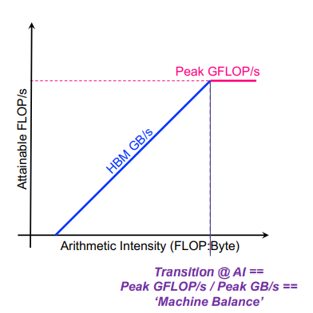

# Roofline model

对于任意一个kernel，我们在进行计算的时候通常会考虑其运算量和访存量

即FLOPS和BYTES, 我们期望通过这两个量以及kernel运行的实际时间来判断当前的kernel是否是一个效率很高的kernel。

那么我们期望的速度：

$$
    Time = max 
    \begin{cases}
        FLOPS / GPU\_MAX\_FLOPS\_per\_sec\\
        BYTES / GPU\_MAX\_BYTES\_per\_sec
    \end{cases}
$$

Roofline Model 主要关注“率”
因此对上述模型进行变形：
$$
    FLOPS/Time = min
    \begin{cases}
        GPU\_MAX\_FLOPS\_per\_sec\\
        (FLOPS/BYTES)* GPU\_MAX\_BYTES\_per\_sec
    \end{cases}
$$
在这里面FLOPS/Time 就是实际的GFLOPS。变量为(FLOPS/BYTES)， 称之为计算强度，**即每Byte的内存交换到底有多少用于浮点运算**
$$
    Gflops/s = min
    \begin{cases}
        Peak Gflops/s \\
        x * Peak GB/s
    \end{cases}
$$

所以我们可以画图：

在这里面所有的点都位于蓝色和红色线的下面，同时越靠近蓝色和红色线的点越接近效率的最高值。

对于蓝色线部分来说，这里的主要限制是Peak GB/s， 称之为Memory_bound

对于红色线部分来说，这里的主要限制是Peak Gflops/s 称之为Compute_bound
